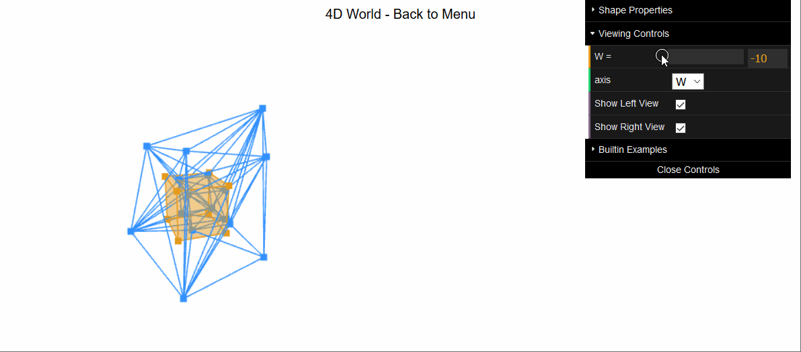
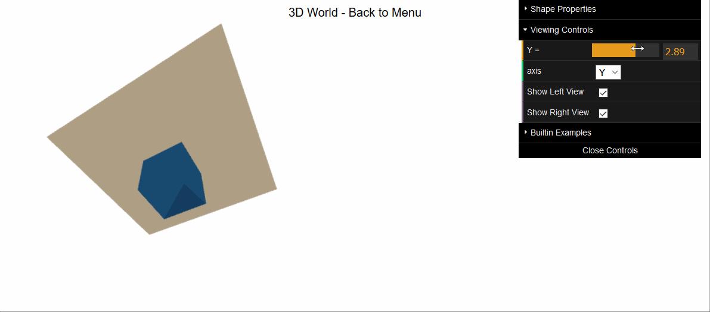

# 4D Geometry Viewer

Thinking about 4 spatial-dimensional geometry is fun, but it's very hard to develop an intuition for at first. We developed this web-based viewer as our capstone project at St. Olaf College. Its original purpose was to teach an _Introduction to 4D Geometry_ class for non-math majors. 

||
|(Left) Projection of a distorted 4D cube. (Right) The 3D cross-sections of the yellow hyper-plane with the 4D object|

Our goal was to let you view 4D objects through a projection view on the left (projected onto an intermediate 3D "screen" which is then projected onto your 2D screen) while seeing the cross sections on the right. The hope is that seeing objects in these two views simultanously aids understanding. 

It's still hard to fully grasp high dimensional ideas like this, so another tool is _dimensional analogy_. You can always drop down one (or two) dimensions and inspect the same phenomenon. It's not obvious why the cross sections of this sheared 4D cube look like a shrinking cube:

||
| Slicing a sheared 4D cube along the W axis gives us cross sections that look like a shrinking cube |

Until you see why the same thing happens in 3D:

||
| Slicing a sheared 3D cube along the Y axis gives us cross sections that look like a shrinking square | 

## How to Use 

The viewer itself is live at: https://stodevx.github.io/humke-4d-geometry/

Not everything is as intuitive as it should be. Check out our usage guide for everything the app can (and cannot) do:

https://github.com/StoDevX/humke-4d-geometry/wiki/Usage

## How it Works

The [developer docs](https://github.com/StoDevX/humke-4d-geometry/wiki/Developer-Docs) provide a brief overview of the project structure. 

## Credits 

The main developers on this project have been [Omar Shehata](https://github.com/OmarShehata), [Joe Peterson](https://github.com/petersbob), [Tianyu Pang](https://github.com/pang-tian-yu) and [Justin Pacholec](https://github.com/justinpac).

Thanks to Professor [Paul Humke](https://www.stolaf.edu/people/humke/) for spearheading this project and acting as our advisor. 

Thanks to [Nick Nooney](https://github.com/nnooney) for the marching cubes implementation. 

We would never have gotten this far without all the insightful [research we've built upon](https://github.com/StoDevX/humke-4d-geometry/wiki/Resources-&-References).